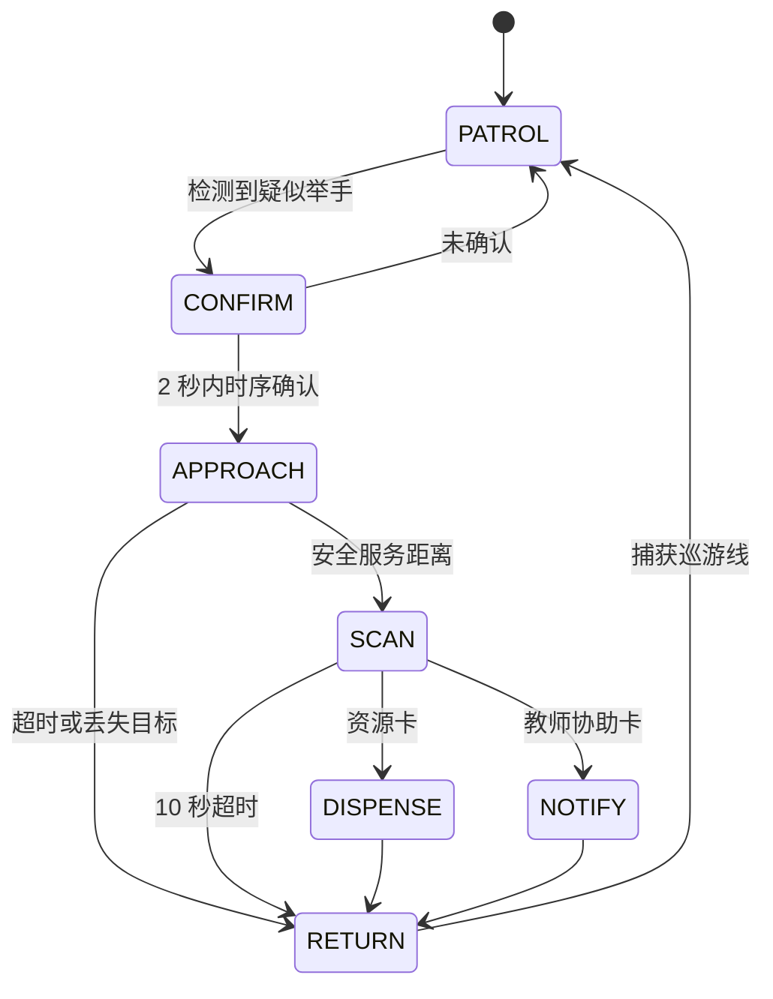
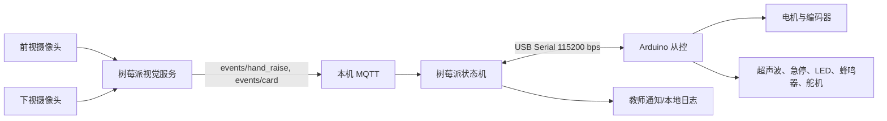

# TA-Bot 项目实施方案

> 项目周期：7 月 19 日至 7 月 27 日（9 个自然日）  
> 团队规模：5 人。本文以可验收的 P0 闭环为中心，先保证安全、可演示和可降级，再投入增强功能。

## 1. 项目目标与执行原则

### 1.1 交付目标

项目最终演示一台以树莓派 5 为主控、Arduino 为实时从控的四轮差速小车。小车在固定单环色带路线中巡游，识别持续举手者，安全靠近至服务距离，识别请求卡，完成发放或教师通知，并重新捕获巡游线后恢复巡游。

P0 闭环定义如下：

### 1.2 不可变的系统边界

- 树莓派负责摄像头取流、视觉推理、任务状态机、MQTT、对外通知，以及向 Arduino 下达速度指令。
- Arduino 只负责电机 PWM、编码器、超声波、舵机、蜂鸣器和 LED 的实时控制，不承担视觉或业务决策。
- 默认视觉链路在树莓派本机完成，不通过 Arduino 传图。若树莓派视觉帧率不足，再采用局域网 PC 推理作为备用。
- 巡游路线先实现无岔路的单向闭环色带。日字形路线、多人队列和网页遥控均为增强项，不能阻塞 P0。
- 所有运动模块都必须支持失效即停止：Arduino 300 ms 未收到树莓派心跳时将 PWM 置零；任何超声波距离小于 0.3 m 时立即停车。

### 1.3 角色代号与投入基线

为便于分工，以下采用固定代号。每日有效工作时间按每人 6 小时估算，共 $5 \times 9 \times 6=270$ 人时；计划预留约 20% 用于现场调试和返工。

| 代号 | 角色 | 核心职责 |
| --- | --- | --- |
| DL-C | Deep Learning 通信负责人 | 树莓派服务、串口协议、MQTT、状态机、模块集成 |
| DL-V1 | Deep Learning 视觉负责人 1 | YOLOv8n-pose 部署、举手规则、时序确认 |
| DL-V2 | Deep Learning 视觉负责人 2 | 数据采集与评测、ArUco/二维码、视觉降级方案 |
| RB-H | Robotics 硬件负责人 | 底盘、电源、传感器、摄像头和资源仓搭建 |
| RB-C | Robotics 控制负责人 | Arduino 固件、循迹 PID、编码器、执行器和串口通信 |

### 1.4 成员具体任务集中总结

下表集中列出每位成员的主责范围。各成员需在每天结束前同步完成状态、测试数据、当前阻塞项和下一步需求；跨模块问题由主责人先定位，再由相关成员共同处理。

| 成员 | 主负责的具体任务 | 关键交付物 | 验收依据与协作接口 |
| --- | --- | --- | --- |
| DL-C（通信负责人） | 1. 编写树莓派主控服务：摄像头服务的启动管理、MQTT 事件订阅、任务状态机、速度/执行器命令下发和统一日志。 2. 生成、打印并开发 ArUco/二维码识别，完成不同距离、角度和光照下的请求卡测试。 3. 实现教师通知、模拟事件/串口回放和必要的演示脚本。 | 串口协议文档；树莓派控制服务；MQTT 主题定义；状态机与运行日志；演示及故障处置脚本 | 与 RB-C 共同验证 300 ms 心跳停车和 1,000 条命令稳定性；接收 DL-V1/DL-V2 的标准事件；向 RB-C 下达 `CMD`/`ACT`，向 RB-H 提出外设与供电需求 |
| DL-V1（视觉负责人 1） | 1. 部署并基准测试 YOLOv8n-pose，优先实现树莓派本机推理，必要时切换局域网 PC 推理。 2. 开发人体框、关键点、举手规则、时序滑动窗口、目标关联和左/中/右方位输出。 3. 完成相机内参/方位标定，输出可供靠近控制使用的 `target_x` 与 `distance_hint`。 4. 维护姿态检测或颜色卡检测的可切换视觉实现。 | 可执行的举手检测服务；性能基线报告；举手事件样例；相机方位标定参数；视觉降级配置 | 在目标场地验证 5 FPS 期望目标或 3 FPS 最低目标；向 DL-C 发布 `events/hand_raise`；与 DL-V2 共同确认检出率、误检率和阈值 |
| DL-V2（视觉负责人 2） | 1. 采集并标注举手、非举手、遮挡和不同光照场景数据，组织视觉回归测试。 2. 调整置信度、滑窗和位置一致性阈值，输出检出率、误检率和确认时间。 3. 维护颜色卡/单卡等低等级交互方案，并参与 PC 推理备用链路验证。 | 场地数据集与测试记录；阈值配置；ArUco/二维码识别服务；请求卡与颜色卡；视觉验收报告 | 举手/非举手各 50 次及每类卡 30 次测试记录；向 DL-C 发布 `events/card`；与 RB-H/RB-C 验证卡片识别距离和资源动作时序 |
| RB-H（硬件负责人） | 1. 安装前视/下视摄像头、编码器、超声波、蜂鸣器、LED 和舵机，并处理防震、视角、旋转中心线和供电问题。 2. 制作、调试双格重力仓；若可靠性不足，及时改为单仓或外置篮筐。 3. 铺设单环色带路线，维护演示场地、备用电源和机械备件。 | 完整车体与接线图；硬件自检表；资源仓/篮筐；单环色带路线；物料与备件清单 | 先通过急停、电源、电机空载和摄像头固定测试；与 RB-C 联合确认传感器引脚和安装位置；向 DL-C 提供稳定的树莓派外设环境 |
| RB-C（控制负责人） | 1. 实现串口命令解析、状态回传、300 ms 心跳超时停车和近障急停。 2. 开发单环巡线 PID、离线里程记录、粗返航和捕线搜索；完成速度、转向和服务距离参数调试。 3. 参与端到端联调，定位运动、返航和执行器故障，维护 Arduino 参数表。 | Arduino 固件；引脚与参数表；传感器/执行器自检程序；巡线与返航测试记录 | 单环至少连续 3 圈不丢线；急停和断连均能停止；与 DL-C 共同完成串口协议和状态机联调；向 RB-H 反馈机械安装与供电问题 |

### 1.5 共同任务与交接规则

- **接口冻结（7 月 20 日）**：DL-C 与 RB-C 共同确认串口消息；DL-V1/DL-V2 确认视觉事件字段。之后仅允许新增可选字段，不能改变现有语义。
- **首次全链路联调（7 月 23 日）**：全员参与。DL-C 操作状态机与日志，DL-V1/2 负责视觉输入和结果判读，RB-C 负责运动与执行器，RB-H 负责现场硬件安全和场地。
- **P0 决断（7 月 24 日）**：每位主责人提交本模块测试数据和建议降级路径；DL-C 汇总为冻结配置，所有成员只围绕选定版本修复缺陷。
- **演示保障（7 月 26 日至 27 日）**：RB-H 管理硬件、路线和备件，RB-C 管理运动复位与急停，DL-V1 管理举手检测模式，DL-V2 管理请求卡与测试卡，DL-C 管理主控服务、日志和演示流程。

## 2. 总体架构与模块接口

### 2.1 最小接口约定

接口在 7 月 20 日结束前冻结；升级功能只能新增字段，不能改变已有命令的语义。

| 接口 | 最小消息 | 发送方向 | 用途 |
| --- | --- | --- | --- |
| 串口速度命令 | `CMD,seq,left_pwm,right_pwm,heartbeat` | 树莓派到 Arduino | 轮速和心跳 |
| 串口状态回传 | `STATE,seq,left_ticks,right_ticks,ultra_l,ultra_r,flags` | Arduino 到树莓派 | 里程、障碍物、急停等状态 |
| 串口执行器命令 | `ACT,seq,servo_id,beep,led` | 树莓派到 Arduino | 发放、提示和故障显示 |
| 举手事件 | `track_id,target_x,distance_hint,conf,timestamp` | 视觉服务到状态机 | 触发确认和靠近 |
| 请求卡事件 | `card_id,conf,timestamp` | 视觉服务到状态机 | 发放或教师通知 |

`seq` 用于去重和日志关联。Arduino 对格式错误命令不执行，对最新心跳超过 300 ms 的情况停车。树莓派只消费时间戳在 500 ms 内的视觉事件，过期事件只记录、不用于运动决策。

## 3. 分模块完成等级

所有模块按“期望实现目标”“最低实现目标”和“增强目标”组织。期望实现目标是最终首选；最低实现目标是截至决断日仍可保留端到端展示价值的版本；增强目标只在 P0 稳定后启动。

### 3.1 硬件搭建与安全电气

| 完成等级 | 交付内容 | 参与人员与分工 | 预期工时 | 与其他等级的兼容性 |
| --- | --- | --- | --- | --- |
| 期望实现 | 四轮差速底盘、树莓派 5、双摄像头、编码器、双超声波、物理急停、蜂鸣器/RGB LED、双格舵机重力仓全部固定；摄像头位于旋转中心线附近；电机和逻辑电源分路并共地 | RB-H 主搭与配线 22 h；RB-C 传感器接线验收 6 h；DL-C 验证树莓派外设 3 h | 31 h | 在最低实现硬件上增装下视摄像头、第二超声波和第二仓位；安装孔和电源余量需一次预留 |
| 最低实现 | 可稳定行驶的四轮底盘、树莓派、前视摄像头、单个前向超声波、物理急停、蜂鸣器/LED、外置单格篮筐或单舵机仓 | RB-H 16 h；RB-C 4 h；DL-C 2 h | 22 h | 可直接运行巡游、举手、停靠、扫码和通知。后续加装器件不改变主控和串口协议 |
| 增强 | 双格仓防卡料导轨、低电量检测、可拆卸摄像头支架、教师端状态灯 | RB-H 10 h；RB-C 3 h | 13 h | 仅在 P0 硬件连续运行 30 min 后实施；不影响最低实现交付 |

实施要点：先完成电源、急停和电机空载测试，再固定摄像头。资源仓必须做连续 20 次出料测试；若成功率低于 95%，立刻改为外置篮筐，由蜂鸣器和 LED 提示用户自取。

### 3.2 Arduino 控制、巡线与返航

| 完成等级 | 交付内容 | 参与人员与分工 | 预期工时 | 与其他等级的兼容性 |
| --- | --- | --- | --- | --- |
| 期望实现 | Arduino 完成左右轮 PWM 和编码器闭环、下视摄像头/色带巡线 PID、双超声波安全停车、离线里程记录、逆向粗返航及视觉/色带捕线；返航搜索上限 15 s | RB-C 主开发 30 h；RB-H 调整传感器位置 5 h；DL-C 对接状态机 8 h | 43 h | 速度、停止、编码器和安全状态接口固定。低等级只禁用部分状态，不删改命令 |
| 最低实现 | 基于三路红外或下视二值化的单环循迹，固定低速 PID；单超声波小于 0.7 m 停止；交互后按编码器粗返航至色带附近并原地搜索捕线 | RB-C 22 h；RB-H 3 h；DL-C 5 h | 30 h | 与期望目标共用电机、编码器、串口和单环路线；将双超声波和精细返航作为可选能力 |
| 增强 | 日字形岔路标记、路口序列、方向校验、网页遥控接管 | RB-C 12 h；RB-H 2 h；DL-C 5 h | 19 h | 只在单环连续 10 圈不丢线后加入；岔路失败时恢复单环，不影响主闭环 |

控制参数初值为：巡线速度低于 0.15 m/s，远距离靠近 0.25 m/s，中距离 0.15 m/s，近距离 0.08 m/s。任意传感器小于 0.3 m 时急停；靠近最长 30 s，目标连续丢失 3 s 时停车并返回。返航时禁止盲目行驶：15 s 未捕获色带，停车并声光告警。

### 3.3 树莓派、Arduino 与软件模块通信

| 完成等级 | 交付内容 | 参与人员与分工 | 预期工时 | 与其他等级的兼容性 |
| --- | --- | --- | --- | --- |
| 期望实现 | USB Serial 115200 bps 的有序命令/状态协议、300 ms 心跳停车、CRC 或校验字段、MQTT 事件总线、状态机日志、模拟器回放工具 | DL-C 主开发 28 h；RB-C 实现 Arduino 解析和回传 14 h；DL-V1/2 各 3 h 接入视觉事件 | 48 h | 最低实现使用同一消息字段和主题，仅省略 CRC、模拟回放和部分诊断字段 |
| 最低实现 | 行分隔文本串口协议，支持 `CMD`、`STOP`、`ACT`、`STATE`、心跳和超时停车；Python 进程内队列或本机 MQTT 均可 | DL-C 16 h；RB-C 9 h；DL-V1 2 h | 27 h | 是期望实现的子集。不得改动速度单位、序号和超时语义，确保升级无需重写 Arduino 固件 |
| 增强 | 教师网页 HTTP/SSE、远程状态面板、PC 推理的 MJPEG 上行和 MQTT 回传 | DL-C 14 h；DL-V2 5 h | 19 h | 与车载安全控制隔离；网络断开不影响 Arduino 超时停车 |

通信验收要求：连续发送 1,000 条速度/停止命令无错序导致的异常运动；拔掉串口或停止心跳后 300 ms 内 PWM 归零；视觉事件延迟超过 500 ms 时不触发新的靠近动作。

### 3.4 举手检测与目标方位

| 完成等级 | 交付内容 | 参与人员与分工 | 预期工时 | 与其他等级的兼容性 |
| --- | --- | --- | --- | --- |
| 期望实现 | 树莓派本机部署 YOLOv8n-pose（优先 NCNN/ONNX），640 x 480 连续取流，5 FPS 推理；基于手腕高于鼻子/肩膀的举手规则、滑窗时序确认、目标关联和方位输出 | DL-V1 模型部署与后处理 26 h；DL-V2 数据采集、阈值标定与评测 24 h；DL-C 对接事件和性能日志 6 h | 56 h | 最低实现复用摄像头、事件格式和方位字段。模型替换只在视觉服务内部进行 |
| 最低实现 | 预训练 YOLOv8n-pose 或明确的黄色/指定颜色手势卡检测；3 FPS 下最近 6 帧至少 4 帧命中，输出左/中/右方位和置信度 | DL-V1 16 h；DL-V2 14 h；DL-C 4 h | 34 h | 同样发布 `events/hand_raise`；状态机只依赖标准化事件，故可无缝切换 |
| 增强 | IoU/中心点目标跟踪、多目标排队、弱光 CLAHE、教室小样本微调、PC GPU 自动回退 | DL-V1 12 h；DL-V2 16 h；DL-C 6 h | 34 h | 只能在期望实现已达到 5 FPS、检出率达到 80% 后投入；否则首先保证标准手势卡降级 |

期望实现的确认规则为：目标推理率 5 FPS 时，最近 10 帧至少 7 帧符合举手规则，确认时间不超过 2 s；同一轨迹的中心点标准差小于画面宽度的 15%。方位由人体框中心计算，控制前进行相机内参标定：

$$
\theta=\arctan\left(\frac{c_x-c_{x0}}{f_x}\right)
$$

若树莓派实测不足 5 FPS，先切至 3 FPS 的低等级时序规则；若仍不稳定，则使用约定颜色卡检测，保持“学生主动发出可识别请求”的交互闭环。

### 3.5 请求卡识别、资源发放与教师通知

| 完成等级 | 交付内容 | 参与人员与分工 | 预期工时 | 与其他等级的兼容性 |
| --- | --- | --- | --- | --- |
| 期望实现 | OpenCV ArUco 或二维码识别两类资源卡与教师协助卡；进入服务距离后蜂鸣提示、10 s 超时；双舵机仓按卡号打开 3 s 后关闭；教师协助卡推送本地 MQTT/网页通知 | DL-V2 卡片识别与测试 15 h；RB-C 舵机动作 8 h；RB-H 仓体调试 8 h；DL-C 状态机与通知 8 h | 39 h | 最低实现使用相同 `card_id` 和 `ACT` 接口，双仓可降为单仓或仅通知 |
| 最低实现 | 一个 ArUco/二维码代表“资源请求”，识别后蜂鸣/LED 提示并打开单仓或由用户从外置篮筐取物；无法识别或超时即返航 | DL-V2 8 h；RB-C 4 h；RB-H 4 h；DL-C 4 h | 20 h | 仅减少卡种和执行器，不改变扫码流程、超时规则或返航逻辑 |
| 增强 | 多类资源、库存计数、卡片方向/距离质量提示、教师网页确认 | DL-V2 8 h；DL-C 8 h；RB-H 2 h | 18 h | P0 已稳定后加入；库存失效时可关闭该卡种并保留其它卡种 |

请求卡优先选择打印的 ArUco 或二维码，而不是训练图案分类模型。每种卡片在 0.2-0.5 m、不同角度与光照下测试 30 次，3 s 内识别率应达到 95%。

### 3.6 系统集成、测试与演示运行

| 完成等级 | 交付内容 | 参与人员与分工 | 预期工时 | 与其他等级的兼容性 |
| --- | --- | --- | --- | --- |
| 期望实现 | 完整 P0 闭环，10 次靠近至少 8 次安全停在 0.5-0.8 m，10 次返航至少 8 次在 15 s 内捕线；单次服务不超过 90 s，连续运行 30 min 无崩溃；演示脚本和故障处置卡 | DL-C 主集成 18 h；RB-C 10 h；RB-H 6 h；DL-V1/2 各 8 h | 50 h | 最低实现是完整联调的简化场景，测试用例和日志结构共用 |
| 最低实现 | 单环巡游 -> 人工或低等级视觉触发 -> 停止在服务点 -> 识别一类卡 -> 发放/提示 -> 原地或粗返航捕线；具备急停和人工遥控/手动回线流程 | DL-C 10 h；RB-C 7 h；RB-H 4 h；DL-V1/2 各 4 h | 29 h | 保留端到端展示、通信和安全路径；可逐项启用期望实现状态 |
| 增强 | 多人队列、岔路、PC 推理热切换、教师网页遥控、低电量告警 | 全员按需 22 h | 22 h | 必须以期望实现验收成功为前提，出现不稳定立即关闭增强功能 |

## 4. 日程、依赖关系与每日验收

下表按自然日规划。当天的“完成判定”必须在当天结束前记录到共享日志；未通过则按第 5 节决断规则削减范围，而非将所有问题推迟到最后两天。

| 日期 | 工作重点 | 负责人 | 当日完成判定 |
| --- | --- | --- | --- |
| 7 月 19 日 | 启动会、物料清点、固定架构与 P0 边界；建立代码仓库、串口消息草案、测试记录表 | 全员；DL-C 主持接口 | 确认所有关键物料可用；接口字段和状态机草图评审通过 |
| 7 月 20 日 | 底盘、电源、急停、电机驱动、摄像头上车；Arduino 电机/舵机/传感器自检；冻结串口接口 | RB-H、RB-C；DL-C 配合 | 急停可切断电机；树莓派与 Arduino 双向收发状态；固定低速直行和停止可用 |
| 7 月 21 日 | 单环色带与巡线 PID；前视取流；YOLOv8n-pose 在开发机/树莓派跑通；生成与打印 ArUco 卡 | RB-C、RB-H、DL-V1、DL-V2 | 小车独立完成 3 圈不丢线；视觉服务能输出标准举手/卡片事件 |
| 7 月 22 日 | 编码器和超声波安全逻辑；举手时序规则与教室数据采集；串口心跳超时停车；资源仓原型 | RB-C、DL-V1、DL-V2、DL-C、RB-H | 串口失联 300 ms 停车；至少 20 段举手与非举手样本；单仓动作成功 10/10 |
| 7 月 23 日 | 首次跨模块联调：巡游暂停、视觉事件、方位转向、靠近停车、扫码和执行器；记录性能基线 | 全员；DL-C 统筹 | 完成至少一次无人工改代码的闭环；得到 FPS、检出率、靠近和返航的首轮数据 |
| 7 月 24 日 | **P0 决断日**：处理首轮故障；选择树莓派或 PC 推理、姿态或颜色卡、双仓或单仓、自动靠近或固定服务点 | 全员；DL-C 记录决策 | 第 5 节所有硬性门槛评审完毕；未达标功能当天开始迁移，停止新增 P1/P2 |
| 7 月 25 日 | 在已选范围内完成返航捕线、异常路径、安全保护和 10 次重复测试；修复最高频缺陷 | 全员，RB-C/DL-C 主集成 | 靠近、扫码、发放和返航各至少完成 8/10 或已启用对应降级路径 |
| 7 月 26 日 | 演示场地实测、连续运行、断连/丢失目标/超时演练；准备演示路线、卡片与备用设备 | 全员 | 连续运行 30 min；演示脚本完整走通 3 次；每个失效场景都有明确停止或人工接管动作 |
| 7 月 27 日 | 最终验收与演示；仅修复阻塞性问题，不再改变架构或添加功能 | 全员 | 以冻结版本完成完整演示；导出测试记录、参数表和故障处置说明 |

### 4.1 并行工作安排

- 7 月 19 日至 21 日，RB-H/RB-C 搭建底盘和控制基线，DL-V1/DL-V2 在开发机上先验证模型和卡片；DL-C 用模拟串口状态机并行开发。这样硬件到位之前不阻塞软件。
- 7 月 22 日起，DL-C 与 RB-C 以冻结串口协议联调；视觉两人只向 MQTT 事件接口交付，不直接驱动电机。
- 7 月 23 日后，除修复 P0 缺陷外，RB-H 负责机械可靠性和场地布线，DL-V2 负责数据回归测试，DL-V1 负责视觉性能回归，DL-C/RB-C 负责状态机与运动集成。

## 5. 决断时点、降级条件与迁移工作

### 5.1 决断原则

1. 安全能力不可降级：急停、超声波安全停车、串口心跳停止和最大运动时间必须始终保留。
2. 降级优先保留“巡游 -> 请求 -> 服务 -> 回到可控状态”的完整故事线，而不是保留某一个高难度算法。
3. 每次降级由 DL-C 记录为配置变更，包括触发数据、关闭功能、启用替代路径、回归测试结果和负责人。
4. 7 月 24 日后不再启动 P1/P2；7 月 26 日后不再恢复已经关闭的高风险功能。

### 5.2 分模块决断表

| 决断时点 | 检查项与高等级通过门槛 | 未通过时的降级选择 | 迁移与适配工作 | 决策负责人 |
| --- | --- | --- | --- | --- |
| 7 月 20 日晚 | 底盘供电稳定，急停生效，树莓派/Arduino 串口双向通信可持续 10 min | 双摄像头、双仓、第二超声波暂不接入；保留前视相机、单超声波、单仓/篮筐 | 将未接入器件从固件配置关闭；保留统一引脚和 `ACT` 命令，不改主状态机 | RB-H、RB-C、DL-C |
| 7 月 21 日晚 | 单环巡线连续 3 圈不丢线；取流达到 640 x 480 | 停止岔路方案，仅保留单环；下视摄像头不稳时改三路红外循迹 | 在状态机中只保留 `PATROL_SINGLE_LOOP`；返航目标改为“回到色带附近后搜索” | RB-C、RB-H |
| 7 月 22 日晚 | YOLOv8n-pose 可稳定产生关键点；树莓派或 PC 至少达到 3 FPS | 先从 5 FPS 规则降到 3 FPS 规则；仍不稳则用指定颜色举手卡 | 保持 `events/hand_raise` JSON 不变；视觉服务替换实现并重新标定 6 帧 4 命中阈值 | DL-V1、DL-V2、DL-C |
| 7 月 23 日晚 | 端到端首次联调至少完成 1 次；靠近过程无碰撞；卡片 3 s 内识别 | 自动靠近改为最近服务点停车并蜂鸣提示学生靠近；卡片仅保留一种 ArUco/二维码 | 状态机将 `APPROACH` 配置为 `SERVICE_POINT`；资源卡映射缩为单一 `card_id`，重新演练超时返回 | DL-C、RB-C、DL-V2 |
| **7 月 24 日晚** | P0 指标：举手确认不超过 2 s、靠近成功至少 8/10、返航捕线至少 8/10、资源动作至少 95% | 关闭未达标的高风险项：本机姿态转 PC 或颜色卡；双仓转单仓/篮筐；自动返航转停车告警和人工回线 | 固化 `deployment_mode`、`request_mode`、`delivery_mode`、`return_mode` 配置；更新演示脚本并运行对应回归用例 | 全员评审，DL-C 最终记录 |
| 7 月 25 日晚 | 选定 P0 路径连续完成 3 次完整流程 | 移除多人、岔路、网页遥控、低电量等增强项；将演示限定为已验证的单一路线与距离 | 删除演示入口中的增强开关，保留代码但默认禁用；冻结物料清单和参数表 | 全员 |
| 7 月 26 日晚 | 连续运行 30 min，演示完整走通 3 次，所有故障均能安全停止 | 最终演示采用最稳定的半自动版本：人工触发请求、固定服务点、手动回线均可，但急停和扫码/发放链路必须有效 | 将人工步骤写入演示运行单；指定操作人；完成一次带人工兜底的全流程彩排 | 全员 |

### 5.3 高低等级的兼容设计

为避免降级时大面积返工，所有模块采用“能力开关”而不是分叉代码：

| 配置项 | 期望值 | 最低值 | 切换影响 |
| --- | --- | --- | --- |
| `vision_mode` | `pose_local` 或 `pose_pc` | `color_card` | 只替换视觉服务内部，事件格式不变 |
| `patrol_mode` | `line_camera_return` | `single_loop_ir` | Arduino 控制策略变化，状态机仍使用 `PATROL`/`RETURN` |
| `approach_mode` | `visual_ultrasonic` | `service_point` | 自动靠近改为巡游线停车；扫码、发放和通知复用 |
| `delivery_mode` | `dual_servo` | `single_servo` 或 `basket` | 保持 `card_id` 到执行动作的映射，未支持卡号返回通知 |
| `return_mode` | `odometry_then_line_search` | `line_search` 或 `manual_recover` | 始终禁止无传感器保护的盲目行驶 |
| `inference_host` | `raspberry_pi` | `lan_pc` | 仅改变视觉部署位置，树莓派到 Arduino 的控制链不变 |

## 6. 测试、验收与日志

### 6.1 分层测试顺序

1. **器件测试**：电源、电机方向、急停、编码器、超声波、舵机、蜂鸣器、LED、两路摄像头分别测试并记录。
2. **接口测试**：通过脚本向 Arduino 模拟速度、停止和执行器命令；通过模拟视觉事件验证状态机的状态迁移。
3. **模块测试**：巡线、举手、卡片、发放和返航分别在不接入其它模块时达到最低门槛。
4. **端到端测试**：按真实流程测量确认时间、服务距离、卡片识别、出料和返航。
5. **故障测试**：拔掉串口、遮挡摄像头、超声波近障、目标丢失、卡片超时、返航找线失败分别验证安全退出。

### 6.2 最终验收表

| 项目 | 方法 | 期望实现验收 | 最低实现验收 |
| --- | --- | --- | --- |
| 巡游 | 单环连续运行 | 10 圈不丢线 | 3 圈不丢线 |
| 举手触发 | 举手/非举手各 50 次 | 检出率至少 80%，误检率不超过 10%，确认不超过 2 s | 人工或颜色卡触发稳定，确认不超过 3 s |
| 方位与靠近 | 左/中/右各 10 次 | 初始转向正确至少 80%，8/10 停在 0.5-0.8 m，无碰撞 | 停在固定服务点并提示用户靠近，无碰撞 |
| 请求卡 | 每类 30 次 | 每类 3 s 内识别率至少 95% | 一类卡 3 s 内识别率至少 95% |
| 发放 | 每仓连续 20 次 | 正确出料至少 95%，动作不超过 5 s | 单仓/篮筐提示连续 10 次有效 |
| 返航 | 不同离线位置 10 次 | 至少 8 次在 15 s 内捕线 | 失败时 15 s 内停车告警并允许人工回线 |
| 安全 | 断连、近障、急停 | 全部场景停止且不再自动恢复运动 | 同左，不允许降级 |
| 稳定性 | 完整流程连续运行 | 30 min 无崩溃 | 完成 3 次连续演示流程 |

### 6.3 日志与现场操作

- DL-C 维护统一时间戳日志，至少记录状态转换、视觉事件、串口命令、传感器读数、超时与急停原因。
- RB-C 每次调整 PID、PWM、超声波阈值后记录参数、场地、轮胎状态和效果，避免现场“凭感觉”覆盖已验证参数。
- DL-V1/DL-V2 保存举手和卡片测试样本的通过/失败标记，作为阈值与降级决策依据。
- 7 月 26 日前完成一页故障处置单：急停后如何复位、找线失败如何人工回线、视觉失效如何切换到颜色卡、资源仓卡料如何改为外置篮筐。

## 7. 风险清单与最终范围控制

| 风险 | 预防措施 | 最终处置 |
| --- | --- | --- |
| 树莓派姿态推理帧率不足 | 7 月 21 日测 FPS，尽早导出轻量模型 | 切换局域网 PC 推理；仍不稳则颜色卡 |
| 举手误检或漏检 | 采集等量负样本，使用时序窗口与方位去抖 | 标准化举手姿势或颜色卡触发 |
| 网络或 MQTT 中断 | 主控与 Arduino 用本地 USB 串口，视觉事件设时效 | Arduino 心跳超时停车；不依赖远程服务继续运动 |
| 返航误差累积 | 色带闭环巡游、编码器只作粗返航 | 15 s 找线失败即停车告警，人工回线 |
| 靠近对象误判/撞障 | 视觉负责方向，超声波只做安全距离，限速限时 | 改固定服务点模式，学生走近小车 |
| 发放卡料 | 先做 20 次连续出料测试 | 单格重力仓，再降级为外置篮筐 |
| 岔路与增强功能挤占时间 | P1/P2 不进入 P0 关键路径 | 固定单环路线，冻结功能范围 |

## 8. 最终冻结版本建议

若 7 月 24 日 P0 数据达到期望门槛，最终版本应采用：树莓派本机 YOLOv8n-pose、5 FPS 时序确认、单环色带巡游、视觉加双超声波自动靠近、ArUco 双卡、双舵机仓、编码器粗返航加捕线。

若任一高风险能力未通过门槛，最终版本应优先采用：单环巡游、颜色卡或人工稳定触发、固定服务点、单一 ArUco 卡、单仓/外置篮筐、返航失败停车告警加人工回线。该版本仍保留树莓派主控、Arduino 从控、通信、安全停车、请求识别和资源服务的核心工程价值，并能在有限时间内稳定完成演示。