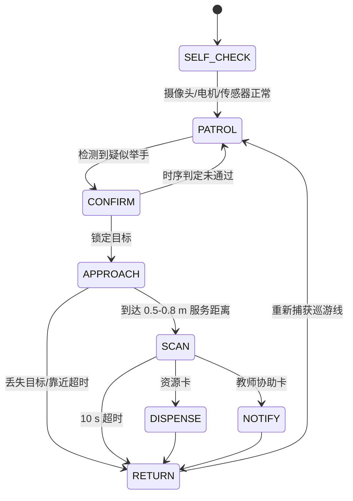
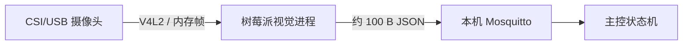

# TA-Bot 深度学习与机器人方案

> 本文对应 Advance Proposal PPT 第 5 页 Deep Learning 和第 6 页 Robotics 的问题，并细化端到端工作流。

## 1. 系统定位与技术边界

- 机器人形态：树莓派 5 主控的四轮差速小车，带前视广角摄像头、下视巡线摄像头、编码器、双超声波、蜂鸣器/LED 和双格舵机发放仓。
- 自主程度：固定路线巡逻、举手检测、靠近、扫码、发放/通知、返航均自主；网页遥控和物理急停作为调试与失效兜底。
- 主控约束：**树莓派是系统主控**。若现有底盘含 Arduino，Arduino 只作为电机 PWM/编码器采集从控，经 USB 串口/UART 接收树莓派速度命令，不负责视觉、决策或任务状态机。
- 最快落地原则：预训练姿态模型 + ArUco/二维码 + 色带巡线 + 舵机翻斗仓，不在 9 天内训练端到端导航或实现 SLAM。

## 2. 端到端任务流程



1. 小车沿单向闭合色带路线巡逻，下视摄像头进行巡线 PID 控制。
2. 前视摄像头连续取帧，姿态模型检测人员和关键点，时序后处理确认举手者。
3. 小车在巡游线上停车，记录离线点、车头方向和编码器值，转向并靠近目标。
4. 到达安全服务距离后蜂鸣提示，切换至请求卡识别，10 秒未识别则退出。
5. 资源卡触发相应舵机仓门；教师协助卡通过 MQTT 推送教师端。
6. 按编码器里程进行粗返航；下视摄像头搜索并重新捕获色带后对正，恢复巡逻。

## 3. Deep Learning：PPT 问题回答

### 3.1 What kind of data?

| 数据 | 来源 | 用途 | 最低准备量 |
| --- | --- | --- | --- |
| 人体姿态图像/视频 | YOLOv8n-pose 的 COCO 预训练数据能力 | 人体框和 17 个关键点 | 无需自行从零训练 |
| 目标教室举手视频 | 两种摄像机高度、3-5 m 距离、不同光照/坐姿/遮挡 | 阈值标定、误检评估；必要时微调 | 10-15 人次，每人 5-10 段，含等量非举手负样本 |
| 请求卡图像 | 实际打印的二维码/ArUco 卡，在 0.2-0.5 m、不同角度和光照采集 | 扫码鲁棒性测试 | 每类 30 次，不训练模型 |
| 巡线与路口图像 | 实际教室色带、阴影、反光和路口 | HSV 阈值/PID 参数标定 | 每类场景 1-2 分钟视频 |

默认不训练新模型。只有预训练姿态模型在目标教室检出率低于 80% 时，才标注少量教室数据微调；若时间不足，降级为“挥动指定颜色卡片”检测。

### 3.2 What is the DL model?

- 主方案：`YOLOv8n-pose`。它同时输出人体 bounding box、类别置信度和 17 个 COCO 人体关键点。
- 举手规则：左或右手腕关键点高于鼻子/肩膀，且人体框置信度和关键点置信度达到阈值。
- 部署：优先树莓派 5 本机使用 NCNN/ONNX int8；实测低于 5 FPS 时，切换为局域网 PC 推理。
- 请求卡识别不是深度学习任务：使用 OpenCV QRCodeDetector 或 ArUco/AprilTag，确定性更强且无需训练。

### 3.3 What preprocessing of inputs?

1. 摄像头以 640×480 采集；优先连续取流后按目标推理帧率抽帧，不重复打开摄像头。
2. YOLO 输入 letterbox 到 640×640、BGR→RGB、像素归一化到 `[0,1]`；由 Ultralytics/导出模型流水线处理。
3. 对过暗画面可启用 CLAHE/自动曝光锁定，但仅在现场测试证明有收益后使用。
4. 请求卡识别先裁剪画面中央服务区，再灰度化；必要时做自适应阈值和透视矫正。
5. 不默认上传 JPEG：摄像头与树莓派同车时，图像通过 CSI/USB 在本机内存中传递。仅 PC 推理降级模式使用 JPEG 质量 70 的 MJPEG 流。

### 3.4 What kind of result from the DL model?

单帧模型输出：

```json
{
  "person_box": [100, 80, 320, 470],
  "person_conf": 0.87,
  "keypoints": [[120, 90, 0.92]],
  "raised": true
}
```

后处理后向机器人状态机发布的结果：

```json
{
  "bearing": "left",
  "target_x": 0.31,
  "distance_hint": "mid",
  "conf": 0.87,
  "track_id": 3
}
```

其中 `target_x` 为人体框中心的归一化横坐标，`bearing` 为左/中/右，`distance_hint` 由人体框高度粗估。

### 3.5 Any post-processing of outputs?

原方案“3 FPS 下检查过去 15 帧”需要 5 秒，不满足 2 秒响应目标，因此改为以下可测试参数：

- 目标推理率 5 FPS；使用最近 10 帧（2 秒）的滑动窗口，至少 7 帧满足举手规则才确认。
- 若只能达到 3 FPS，改用最近 6 帧且至少 4 帧命中，仍将确认时间控制在 2 秒内。
- 用人体框 IoU 或中心点最近邻关联同一人；同一轨迹中心点标准差应小于画面宽度的 15%。
- 多人同时举手时，先按首次确认时间排序，再按置信度选择；锁定后忽略其他目标直到本次服务结束。
- 连续 3 帧丢失目标时停车搜索；超过 3 秒仍未恢复则放弃并返航。
- 同一方位事件 3 秒内去抖，避免主控重复入队。

### 3.6 图像采集与传输

**默认链路（推荐）**：



- 视觉结果走 MQTT：`events/hand_raise`、`events/qr`；原始图像不走 MQTT。
- 若使用 Arduino 底盘，树莓派通过 USB 串口发送左右轮目标速度，Arduino 返回编码器计数；图像不经过 Arduino。

**PC 推理备用链路**：树莓派将 640×480、JPEG 质量 70、5-10 FPS 的 MJPEG 推到 PC；PC 推理后仍通过 MQTT 回传结构化事件。局域网带宽约 3-8 Mbps。

## 4. Robotics：PPT 问题回答

### 4.1 Is it a car or something else?

它是一台四轮差速移动机器人。左右两侧轮组分别控制，通过左右轮速度差实现直行、转弯和原地旋转；上层承载树莓派、电池、摄像头和双格资源仓。

### 4.2 What sensors/components?

| 组件 | 作用 |
| --- | --- |
| 树莓派 5 | 系统主控、视觉推理、MQTT、状态机和教师端 |
| 前视广角摄像头 | 举手检测、目标方位、请求卡识别 |
| 下视摄像头 | 色带巡线、返航时重新捕获轨道、路口标记识别 |
| 带编码器减速电机 ×4 | 运动与相对里程估计 |
| HC-SR04 ×2 | 前向安全避障和最后停车保护，不单独用于识别“学生” |
| TB6612FNG 电机驱动 | 左右轮 PWM 和方向控制 |
| 舵机 ×2 | 打开对应资源仓门 |
| 蜂鸣器 + RGB LED | 举卡提示、状态和故障告警 |
| 物理急停 | 硬件切断电机供电 |
| Arduino（可选） | 仅作实时电机/编码器从控，非主控 |

### 4.3 What actuation?

- 差速底盘：前进、减速、原地转向、巡线和返航。
- 舵机发放仓：按卡片编码打开 1/2 号仓，3 秒后关闭。
- 蜂鸣器/LED：提示学生举卡、取件和异常。
- 教师协助请求不执行机械动作，而是向教师网页推送位置和时间。

不建议在 9 天内使用夹爪或传送带：机械复杂度、定位精度和卡料风险明显高于重力滑出式舵机仓。

### 4.4 Autonomous or teleoperated?

- 正常模式：自主巡逻和服务。
- 监督模式：教师网页可启动、暂停、急停。
- 兜底模式：键盘/网页遥控，用于调试或自动返航失败时接管。

### 4.5 What communication method?

| 链路 | 协议 | 内容 |
| --- | --- | --- |
| 摄像头→树莓派 | CSI/USB + V4L2 | 原始视频帧，本机传输 |
| 树莓派→Arduino（可选） | USB Serial/UART，115200 bps | 左右轮速度、停止命令；编码器回传 |
| 软件模块间 | MQTT over TCP | 检测事件、运动命令、机器人状态 |
| 教师浏览器→树莓派 | HTTP + SSE | 控制命令、状态和通知 |
| 树莓派→PC（备用） | MJPEG/RTSP + MQTT | 压缩图像上行、推理结果下行 |

通信失联时采用“失效即停止”：Arduino 超过 300 ms 未收到树莓派心跳立即将 PWM 置零；主控超过 3 秒未收到视觉结果则取消靠近。

## 5. 关键问题的具体解决方案

### 5.1 如何根据画面位置转向？

不要直接凭经验把像素映射为固定转角。先标定摄像头水平内参 `fx` 和光心 `cx0`，根据人体框中心 `cx` 计算目标偏航角：

$$
	heta = \arctan\left(\frac{c_x-c_{x0}}{f_x}\right)
$$

控制策略：

1. 小车原地旋转，使归一化横向误差 $e_x=(c_x-c_{x0})/W$ 进入 ±0.08；
2. 对准后低速前进，并持续用 $e_x$ 做比例修正；
3. 摄像头尽量安装在底盘旋转中心线上，减少原地旋转造成的平移视差；
4. 最大角速度和转向持续时间设上限，避免误检导致连续旋转。

### 5.2 如何最后靠近用户？

采用“视觉跟踪负责方向和粗距离，超声波负责安全停车”的分层控制：

1. 人体框高度比例仅用于 `far/mid/near` 粗分档，不作为最终距离真值；
2. `far` 时以 0.25 m/s 前进，`mid` 时降至 0.15 m/s，`near` 时降至 0.08 m/s；
3. 任一超声波距离小于 0.7 m 时停止，将服务距离控制在 0.5-0.8 m；
4. 任一超声波距离小于 0.3 m 时触发安全急停；
5. 左右超声波差值可用于小幅修正朝向，但不能区分学生、桌椅和墙，必须与目标视觉轨迹共同判断；
6. 靠近过程最长 30 秒，丢失目标 3 秒或道路被阻挡时停止并返航。

### 5.3 如何回到巡游轨道？

只按转角和距离逆向行驶属于开环航位推算，轮胎打滑后会累积误差，不能作为唯一方案。采用三阶段返航：

1. **离线记录**：离开巡线前停车，记录左右编码器、离开方向、最近路段/路口标记 ID；
2. **编码器粗返航**：将服务路径的左右轮里程分段入栈，返航时逆序执行反向速度，回到巡线附近；
3. **视觉闭环捕线**：下视摄像头低速旋转搜索黄色色带；发现后使色带中心回到 ROI 中央，再沿规定方向恢复巡线。

返航搜索超过 15 秒仍未捕线：停车、声光告警并通知教师，禁止盲目继续运动。演示场地应将离线服务半径限制在 1-1.5 m，以提高成功率。

### 5.4 “日”型走廊的岔路如何处理？

9 天交付的首选方案是把巡游线设计为**无歧义的单向闭合环**，不经过岔路；这是最稳的 P0 演示路线。

若必须覆盖“日”型路线，采用“路口标记 + 固定路由表”，不让机器人仅凭线形猜测：

1. 每个岔路前 20-30 cm 贴唯一 ArUco ID；下视摄像头识别 `junction_id`；
2. 配置固定路由，例如 `J1:right → J2:left → J3:right`，每次到达路口按表执行；
3. 路口处先降速，检测多个分支的轮廓，再执行指定转向，直到重新检测到单一中心线；
4. 记录当前 `junction_id + segment_id + travel_direction`，教师通知的位置也使用该编号；
5. ArUco 未识别或路口图像不确定时默认停车，不随机选路。

低位替代：用不同颜色短条编码路口动作（蓝=左、绿=直、红=右），但 ArUco ID 可扩展性和抗混淆性更好。

## 6. 失效保护与备选方案（PPT failsafe / backup 要求）

| 主方案失败 | 检测条件 | 备选方案 | 保留价值 |
| --- | --- | --- | --- |
| 姿态模型 <5 FPS | 树莓派基准测试 | 切 PC 推理；再降级为黄色卡片色块检测 | 仍可触发服务闭环 |
| 举手检出率 <80% | 教室验证集 | 调阈值/微调；最后改为标准手势卡 | 保留视觉交互 |
| 自主靠近不稳定 | 10 次成功 <8 次 | 停在最近巡线服务点并蜂鸣提示学生靠近 | 保留扫码和发放 |
| 自动返航失败 | 15 秒未捕获色带 | 停车告警，教师遥控回线 | 不发生盲目运动 |
| 请求卡模型不稳 | 3 秒识别率 <95% | ArUco/二维码确定性识别 | 功能不变 |
| 发放机构卡料 | 连续 10 次 <95% | 单格重力滑仓或人工从外置篮取件 | 保留资源配送 |
| Wi-Fi/MQTT 中断 | 心跳超时 3 秒 | 本地控制继续安全停车；教师端改热点 | 保留硬件安全 |

## 7. 实验与验收方法

| 实验 | 方法 | 通过标准 |
| --- | --- | --- |
| 举手检测 | 3-5 m，举手/非举手各 50 次，覆盖坐姿和遮挡 | 检出率 ≥80%，误检率 ≤10%，确认 ≤2 s |
| 方位控制 | 左/中/右各 10 次 | 初始转向方向正确 ≥80% |
| 靠近 | 不同初始方位 10 次 | ≥8 次停在 0.5-0.8 m，无碰撞 |
| 请求卡 | 每类 30 次，不同角度和光照 | 3 s 内识别 ≥95% |
| 发放 | 每仓连续 20 次 | 正确出料 ≥95%，动作 ≤5 s |
| 返航 | 不同离线角度/距离 10 次 | ≥8 次在 15 s 内重新捕获巡线 |
| 岔路（若启用） | 完整“日”型路线 5 圈 | 路由选择 100% 正确，否则降级单环 |
| 整机闭环 | 举手→靠近→扫码→处理→返航 | 单次 ≤90 s，连续运行 30 min 无崩溃 |

## 8. 9 天内的实施优先级

1. **P0（必须）**：单环巡线、举手检测、超声避障、请求卡识别、双格发放/教师通知、返航捕线、急停。
2. **P1（有余力）**：路口 ArUco、多人队列、PC 推理切换、低电量管理。
3. **P2（只作展示加分）**：自动曝光优化、目标跟踪 ID、网页遥控。
4. 7 月 24 日后若 P0 未全部联通，停止 P1/P2，按第 6 节立即启用降级方案。
