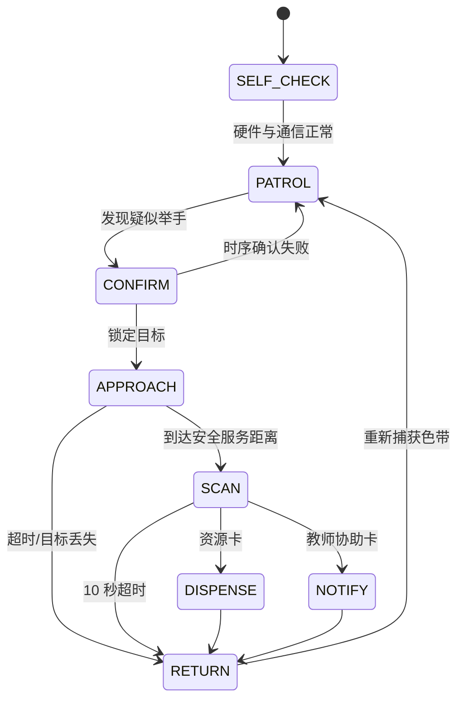
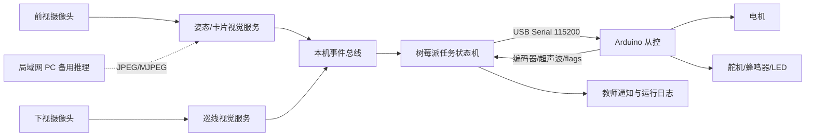
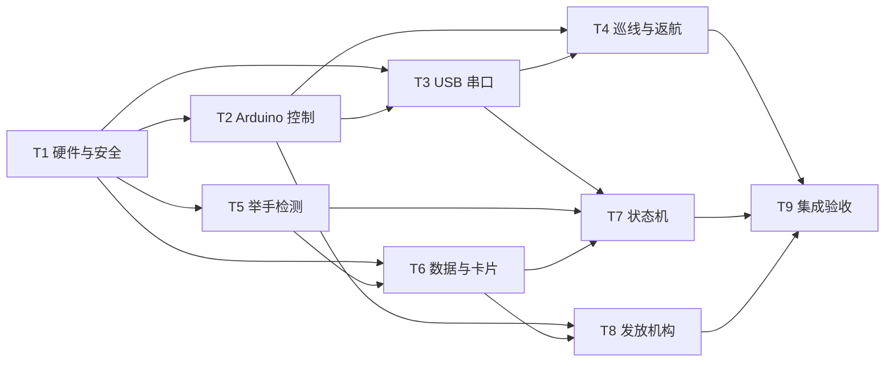
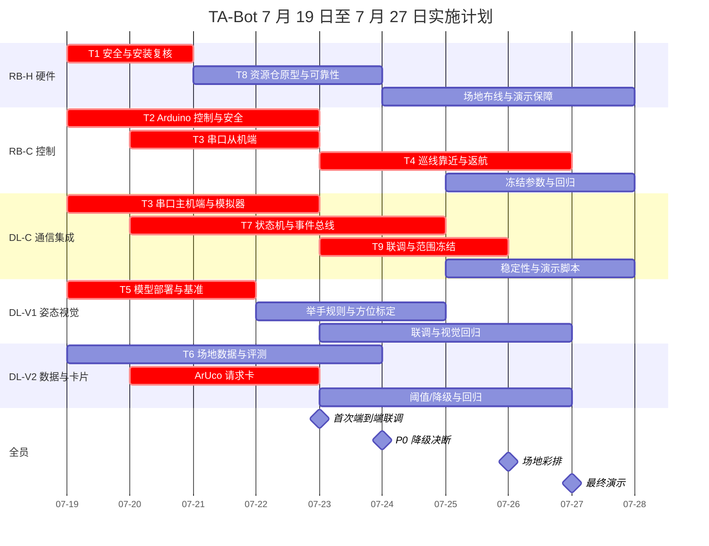

# TA-Bot 详细项目实施方案

> 项目周期：7 月 19 日至 7 月 27 日（9 个自然日）  
> 团队：Deep Learning 3 人，Robotics 2 人  
> 方案依据：[analysis.md](analysis.md) 与 [plan.md](plan.md)

## 1. 项目范围与成功标准

### 1.1 当前基础

- 四轮差速小车已经完成基础搭建，由 Arduino 控制四轮电机并读取传感器。
- 树莓派与 Arduino 已通过 USB 连接；本项目在此基础上定义稳定的串口协议和失联停车机制。
- `Baseline/` 中已有图像接收、TCP/HTTP 通信和模型推理代码，可复用服务结构、图像编解码与结果序列化思路，但当前猫分类模型不能直接用于举手检测。
- 项目不在 9 天内训练端到端导航模型，也不实现 SLAM。巡游采用地面色带闭环，举手采用预训练姿态模型，请求识别采用 ArUco/二维码。

### 1.2 最终期望闭环

期望版本应完成“单环巡游 → 举手确认 → 安全靠近 → 请求卡识别 → 发放/通知 → 捕线返航”的完整自主闭环。最低版本必须保留安全停车、稳定触发、请求识别和资源服务，可以将自动靠近降为固定服务点、将自动返航降为停车告警和人工回线。

### 1.3 系统职责边界

| 节点 | 负责 | 不负责 |
| --- | --- | --- |
| 树莓派 5 | 双摄像头取流、姿态推理、巡线图像处理、请求卡识别、任务状态机、日志、教师通知、向 Arduino 下发目标轮速 | 电机 PWM 的硬实时生成、图像经 Arduino 中转 |
| Arduino | 电机 PWM/方向、编码器、超声波、舵机、蜂鸣器、LED、心跳超时停车、近障急停 | 深度学习推理、任务决策、网络图像传输 |
| 局域网 PC（备用） | 树莓派性能不足时执行姿态推理 | 直接控制 Arduino 或绕过树莓派安全状态机 |

任何软件异常都不能绕过两条硬性安全条件：Arduino 超过 300 ms 未收到有效心跳时 PWM 归零；任一有效超声波距离小于 0.3 m 时立即停车。

## 2. 人员代号与协作方式

| 代号 | 岗位 | 主责范围 |
| --- | --- | --- |
| DL-C | Deep Learning 通信/集成负责人 | 树莓派主控、串口协议、MQTT/进程通信、状态机、日志、端到端集成 |
| DL-V1 | Deep Learning 视觉负责人 1 | YOLOv8n-pose 部署、关键点规则、目标方位、推理性能 |
| DL-V2 | Deep Learning 视觉负责人 2 | 场地数据、阈值评测、ArUco/二维码、视觉降级方案 |
| RB-H | Robotics 硬件负责人 | 车体复核、相机/传感器安装、供电、急停、色带与资源仓 |
| RB-C | Robotics 控制负责人 | Arduino 固件、轮速/编码器、超声波、执行器、串口从控、运动调参 |

按每人每天约 6 个有效工时估算，总容量为 270 人时。第 4 节各等级的工时是该模块独立实施时的工作量上限，其中联调会议和共同测试会同时出现在多个模块，不能直接相加。实际排期按下表控制在 234 人时，预留 36 人时用于返工和演示保障。

| 成员 | 确定工作预算 | 机动预算 | 主要用时方向 |
| --- | ---: | ---: | --- |
| DL-C | 48 h | 6 h | 串口主机端、状态机、集成与日志 |
| DL-V1 | 45 h | 9 h | 姿态部署、后处理、方位和视觉回归 |
| DL-V2 | 45 h | 9 h | 数据评测、请求卡和降级视觉 |
| RB-H | 43 h | 11 h | 硬件复核、场地、资源仓和演示保障 |
| RB-C | 53 h | 1 h | Arduino、巡线、靠近、返航和运动回归 |
| **合计** | **234 h** | **36 h** | **总容量 270 h** |

RB-C 的机动空间最小，因此 7 月 21 日后不得向其追加岔路、网页遥控等增强任务；若运动链出现阻塞，RB-H 优先协助场地与机械定位，DL-C 优先提供串口回放和日志定位。所有任务以“可运行代码/硬件 + 测试记录”为完成标准，不以“代码已写完”为完成标准。

## 3. 总体架构与冻结接口

### 3.1 7 月 20 日冻结的最小接口

| 接口 | 最小字段 | 方向 | 说明 |
| --- | --- | --- | --- |
| `CMD` | `seq,left_pwm,right_pwm,heartbeat` | 树莓派 → Arduino | 目标轮速；Arduino 只执行最新序号 |
| `STOP` | `seq,reason` | 树莓派 → Arduino | 显式停车，优先级高于普通轮速 |
| `ACT` | `seq,servo_id,beep,led` | 树莓派 → Arduino | 发放及声光提示 |
| `STATE` | `seq,left_ticks,right_ticks,ultra_l,ultra_r,flags` | Arduino → 树莓派 | 编码器、距离、急停与故障状态 |
| `hand_raise` | `track_id,target_x,distance_hint,conf,timestamp` | 视觉 → 状态机 | `target_x` 为归一化水平位置 |
| `line_error` | `offset,quality,timestamp` | 巡线视觉 → 状态机 | `offset` 范围为 `[-1,1]` |
| `card` | `card_id,conf,timestamp` | 视觉 → 状态机 | 请求卡与教师协助卡 |

接口冻结后只能新增可选字段，不能更改已有字段的单位和语义。树莓派拒绝超过 500 ms 的视觉事件；Arduino 对格式错误、校验失败或过期序号不执行。

## 4. 工作包、完成等级与依赖

### 4.1 任务索引

| ID | 工作包 | 主负责人 | 直接前置条件 | 核心输出 |
| --- | --- | --- | --- | --- |
| T1 | 硬件复核与安全 | RB-H | 现有小车 | 接线图、自检表、急停与稳定供电 |
| T2 | Arduino 运动与执行器 | RB-C | T1 | 固件、参数表、传感器/执行器状态 |
| T3 | USB 串口通信 | DL-C + RB-C | T1、T2 基础自检 | 串口协议、心跳、回放测试 |
| T4 | 巡线与返航 | RB-C | T1、T2、T3 | 单环巡线、粗返航、捕线 |
| T5 | 举手检测与方位 | DL-V1 | 前视相机可用 | 标准举手事件、FPS 基线 |
| T6 | 数据评测与请求卡 | DL-V2 | 前视相机可用、T5 输出格式 | 阈值报告、标准卡片事件 |
| T7 | 树莓派状态机与通知 | DL-C | T3、T5/T6 模拟事件 | 状态机、日志、教师通知 |
| T8 | 资源发放机构 | RB-H + RB-C | T1、T2、T6 卡号定义 | 舱体、动作映射、可靠性记录 |
| T9 | 端到端集成与验收 | DL-C | T3 至 T8 的最低目标 | 冻结版本、测试报告、演示脚本 |

### 4.2 T1：硬件复核与安全

| 等级 | 目标与实施方案 | 人员分工 | 预期工时 | 兼容关系 |
| --- | --- | --- | --- | --- |
| 期望 | 在现有底盘上固定树莓派、前视/下视相机、双超声波、编码器、物理急停、蜂鸣器/LED 和双格舵机仓；电机与逻辑供电分路并共地；前视相机靠近旋转中心线 | RB-H 18 h 主搭；RB-C 4 h 验线；DL-C 2 h 验证树莓派外设 | 24 h | 建立在最低目标之上，安装位与供电需预留升级空间 |
| 最低 | 保留稳定底盘、树莓派、前视相机、单超声波、急停、蜂鸣器/LED 和外置篮筐；下视视觉不稳定时预留三路红外传感器位 | RB-H 12 h；RB-C 3 h；DL-C 1 h | 16 h | 所有接口与期望目标一致；未安装器件由能力开关禁用 |
| 增强 | 防卡料导轨、低电量检测、可拆相机架和备用电池快速更换 | RB-H 7 h；RB-C 2 h | 9 h | 仅在整车连续运行 30 min 后开展 |

前置条件：现有电机、驱动板和 Arduino 能独立完成前进、后退与停止。验收顺序必须为供电与急停、空载电机、传感器、相机、舵机，不能带轮上地直接测试未知固件。

### 4.3 T2：Arduino 运动、安全与执行器

| 等级 | 目标与实施方案 | 人员分工 | 预期工时 | 兼容关系 |
| --- | --- | --- | --- | --- |
| 期望 | 左右轮目标 PWM/轮速控制、编码器计数、双超声波滤波、舵机双仓、声光状态；300 ms 心跳停车、0.3 m 近障急停 | RB-C 22 h；RB-H 4 h 调机械/传感器 | 26 h | 最低固件是同一状态机的配置子集 |
| 最低 | 开环低速 PWM、编码器原始计数、单超声波停车、单舵机或声光提示、串口失联停车 | RB-C 14 h；RB-H 3 h | 17 h | 后续增加闭环与第二外设无需改命令语义 |
| 增强 | 轮速 PID、低电量限速、故障码与网页遥控接管 | RB-C 8 h；DL-C 2 h | 10 h | 不得削弱本地安全逻辑 |

直接依赖 T1 的稳定供电与接线。T3 依赖本任务能接受固定测试命令并返回状态；T4 和 T8 分别依赖运动接口与执行器接口。

### 4.4 T3：树莓派与 Arduino USB 通信

| 等级 | 目标与实施方案 | 人员分工 | 预期工时 | 兼容关系 |
| --- | --- | --- | --- | --- |
| 期望 | 115200 bps 行协议或轻量帧协议，带 `seq`、校验、ACK/状态回传；心跳线程、自动重连、统一日志、模拟串口回放 | DL-C 18 h 主机端；RB-C 9 h 从机端；DL-V1 1 h 接口样例 | 28 h | 最低协议保留全部必需字段，升级仅增加校验和诊断 |
| 最低 | 行分隔文本协议，支持 `CMD/STOP/ACT/STATE`；300 ms 超时停车；断线后必须人工确认才恢复运动 | DL-C 10 h；RB-C 6 h | 16 h | 可直接升级，不更改速度单位与安全语义 |
| 增强 | CRC、命令统计、串口录制回放、故障注入工具 | DL-C 6 h；RB-C 2 h | 8 h | 与期望协议向后兼容 |

前置条件为 T2 的串口解析入口和状态采集函数。验收为连续 1,000 条命令无异常运动，拔掉 USB 或停止心跳后 300 ms 内 PWM 归零。

### 4.5 T4：固定路线巡线、靠近与返航

| 等级 | 目标与实施方案 | 人员分工 | 预期工时 | 兼容关系 |
| --- | --- | --- | --- | --- |
| 期望 | 树莓派下视相机以 HSV/二值化输出色带偏差，状态机做巡线 PID；离线时记录编码器分段，靠近后逆序粗返航，再低速旋转搜索并捕线 | RB-C 20 h 运动控制；DL-C 7 h 接巡线/状态机；RB-H 4 h 铺线调相机 | 31 h | 与最低目标共用单环路线、轮速命令和 `RETURN` 状态 |
| 最低 | 三路红外或稳定的二值化巡线，固定低速走单环；交互在巡游线服务点进行，或粗返航后搜索 15 s，失败即停车告警 | RB-C 13 h；RB-H 3 h；DL-C 4 h | 20 h | 是期望模式的配置降级，无需改视觉事件与扫码流程 |
| 增强 | “日”型岔路、路口 ArUco/颜色标记、路口序列和遥控接管 | RB-C 8 h；DL-C 4 h；RB-H 2 h | 14 h | 仅在单环连续 10 圈成功后启用 |

前置条件为 T2 的稳定轮控和 T3 的低延迟指令。靠近时 YOLO 只负责“找谁、往哪转”，超声波负责“何时安全停车”：`far/mid/near` 速度建议为 0.25/0.15/0.08 m/s，0.7 m 进入服务停止区，0.3 m 强制急停。返航搜索超过 15 s 禁止继续盲走。

### 4.6 T5：举手检测、目标关联与方位

| 等级 | 目标与实施方案 | 人员分工 | 预期工时 | 兼容关系 |
| --- | --- | --- | --- | --- |
| 期望 | YOLOv8n-pose 在树莓派以 NCNN/ONNX 运行 5 FPS；手腕高于鼻子/肩膀；最近 10 帧至少 7 帧命中；目标中心标准差小于画宽 15%；输出 `target_x` 和粗距离 | DL-V1 24 h；DL-V2 7 h 评测；DL-C 3 h 性能日志 | 34 h | 模型实现封装在服务内，事件契约与最低目标相同 |
| 最低 | 预训练姿态模型稳定达到 3 FPS，最近 6 帧至少 4 帧命中；若仍不稳，检测指定黄色举手卡并输出左/中/右 | DL-V1 14 h；DL-V2 6 h；DL-C 2 h | 22 h | 状态机无感切换，仅调整 `vision_mode` |
| 增强 | 多目标队列、教室小样本微调、CLAHE、局域网 PC 自动回退 | DL-V1 9 h；DL-V2 9 h；DL-C 3 h | 21 h | 检出率达到 80% 且 P0 稳定后才能开展 |

本任务依赖 T1 的前视相机，但可在开发机和录制视频上先行。相机水平角采用内参关系

$$
\theta=\arctan\left(\frac{c_x-c_{x0}}{f_x}\right)
$$

进行标定，不用未经校准的线性像素角度映射。目标场地需完成举手/非举手各 50 次测试，期望检出率至少 80%、误检率不高于 10%、确认时间不超过 2 s。

### 4.7 T6：场地数据、请求卡与视觉验收

| 等级 | 目标与实施方案 | 人员分工 | 预期工时 | 兼容关系 |
| --- | --- | --- | --- | --- |
| 期望 | 采集 10 至 15 人次、不同光照/距离/遮挡的视频；建立通过/失败记录；识别两类资源 ArUco 卡和一类教师协助卡，0.2 至 0.5 m 下测试 | DL-V2 22 h；DL-V1 5 h 联合调阈值；RB-H 2 h 制卡/现场 | 29 h | 最低目标复用相同卡片检测器与 `card_id` |
| 最低 | 录制等量举手/非举手样本；使用一种 ArUco/二维码资源卡，10 s 超时，3 s 内识别率达到 95% | DL-V2 13 h；DL-V1 3 h | 16 h | 增加卡种只扩充配置映射 |
| 增强 | 自动生成评测报告、卡片距离/角度质量提示、姿态微调数据集 | DL-V2 8 h；DL-V1 5 h | 13 h | 不能占用 P0 回归测试时间 |

前视相机是硬件前置条件；举手阈值评测依赖 T5，但卡片检测可与 T5 并行。请求卡不训练新的图案分类模型，以避免数据采集与泛化风险。

### 4.8 T7：树莓派状态机、模块通信与教师通知

| 等级 | 目标与实施方案 | 人员分工 | 预期工时 | 兼容关系 |
| --- | --- | --- | --- | --- |
| 期望 | 本机 MQTT 或进程队列连接视觉、巡线与主控；实现完整状态机、事件过期丢弃、动作超时、统一日志和 HTTP/SSE 教师通知 | DL-C 24 h；DL-V1/DL-V2 各 2 h 接事件；RB-C 3 h 联调 | 31 h | 最低版本使用同一状态枚举和事件类型 |
| 最低 | 单 Python 主进程或本机 MQTT；完成 `PATROL/CONFIRM/SERVICE/RETURN/ERROR`，支持模拟事件；教师请求以本地日志和蜂鸣器表示 | DL-C 15 h；DL-V1 1 h；RB-C 2 h | 18 h | 后续可增加状态与 UI，不改 Arduino 协议 |
| 增强 | 教师网页、实时状态面板、远程暂停、PC 推理热切换 | DL-C 10 h；DL-V2 3 h | 13 h | 与车载安全链隔离，网络中断不能导致继续运动 |

T7 可先用模拟 `hand_raise/card/STATE` 并行开发；真实集成依赖 T3、T5、T6。所有状态必须定义进入动作、退出条件、超时、失败去向和允许的 Arduino 命令。

### 4.9 T8：资源仓与服务动作

| 等级 | 目标与实施方案 | 人员分工 | 预期工时 | 兼容关系 |
| --- | --- | --- | --- | --- |
| 期望 | 双格重力滑仓，卡号映射到对应舵机，打开约 3 s 后关闭；教师卡只通知不出料；每仓连续测试 20 次 | RB-H 9 h 机械；RB-C 6 h 动作；DL-C 3 h 状态映射；DL-V2 2 h 卡号 | 20 h | 最低方案保留 `ACT` 和卡号映射 |
| 最低 | 单格舵机仓；若仍卡料则外置篮筐，识别后蜂鸣/LED 提示用户自取 | RB-H 5 h；RB-C 3 h；DL-C 2 h | 10 h | 不改变扫码与返航流程 |
| 增强 | 库存计数、防重复发放和仓门位置反馈 | RB-H 3 h；RB-C 4 h；DL-C 3 h | 10 h | 仅在出料成功率达到 95% 后开展 |

T8 依赖 T2 的舵机/声光控制和 T6 的卡号定义。夹爪和传送带不进入本周期范围；其定位与卡料调试成本明显高于重力仓。

### 4.10 T9：集成、测试与演示

| 等级 | 目标与实施方案 | 人员分工 | 预期工时 | 兼容关系 |
| --- | --- | --- | --- | --- |
| 期望 | 完整自主闭环；靠近 8/10 停在 0.5 至 0.8 m；返航 8/10 在 15 s 内捕线；单次不超过 90 s；连续运行 30 min | DL-C 12 h 统筹；RB-C 8 h；RB-H 5 h；DL-V1/DL-V2 各 6 h | 37 h | 测试脚本覆盖所有低等级模式 |
| 最低 | 单环巡游、稳定触发、固定服务点、识别一类卡、单仓/篮筐服务；返航失败能停车告警并人工回线；连续完成 3 次 | DL-C 7 h；RB-C 5 h；RB-H 3 h；DL-V1/DL-V2 各 3 h | 21 h | 是同一状态机的能力开关组合 |
| 增强 | 多人、岔路、网页遥控、自动推理切换 | 全员按需，最多 15 h | 15 h | 只有期望闭环连续通过后才允许启用 |

## 5. 时间安排与甘特图

### 5.1 每日里程碑

| 日期 | 关键工作 | 当日退出条件 |
| --- | --- | --- |
| 7 月 19 日 | 启动、物料/现状复核、任务 ID 和接口草案、开发环境 | 确认 P0 范围、负责人、硬件缺口与测试记录模板 |
| 7 月 20 日 | 硬件安全、电机/传感器自检、串口最小闭环、接口冻结 | 急停有效；树莓派可命令 Arduino 低速运动并收到 `STATE` |
| 7 月 21 日 | 单环巡线；姿态模型与 ArUco 跑通；状态机用模拟事件运行 | 巡线 3 圈；两个视觉服务均能输出冻结格式 |
| 7 月 22 日 | 心跳/近障安全；举手阈值；资源仓；靠近控制 | 断联 300 ms 停车；资源动作 10/10；取得视觉性能基线 |
| 7 月 23 日 | 第一次全链路联调和故障定位 | 至少完成一次不改代码的完整闭环或明确每个阻塞点 |
| 7 月 24 日 | **范围决断日**，按数据选择高/低等级并完成迁移 | 冻结 `vision/approach/delivery/return` 模式，停止新增增强项 |
| 7 月 25 日 | 冻结范围回归、返航与异常路径、10 次重复测试 | 各 P0 项达到门槛或已切换并验证最低路径 |
| 7 月 26 日 | 场地彩排、30 min 稳定性、断连/遮挡/超时演练 | 演示流程连续通过 3 次，人工兜底操作写入运行单 |
| 7 月 27 日 | 最终验收与演示 | 只修阻塞缺陷，不改架构和范围；归档参数与报告 |

### 5.2 分工甘特图

甘特图中的任务存在部分并行：DL-V1/DL-V2 可先用录制视频工作，DL-C 可用模拟串口和模拟视觉事件开发状态机；真实硬件联调必须等 T1 至 T3 的最低目标完成。关键路径为 `T1 → T2/T3 → T4/T7 → T9`。

## 6. 降级决断与迁移适配

### 6.1 决断原则

1. 急停、300 ms 心跳停车、0.3 m 近障停车、运动超时不可降级。
2. 优先保留完整服务闭环，而不是保留某个高难度算法。
3. 所有高低等级共用接口，通过配置切换，不维护临时分叉代码。
4. 7 月 24 日晚冻结 P0 功能；7 月 26 日后不得重新启用已淘汰的高风险能力。

### 6.2 决断表

| 决断时点 | 高等级继续条件 | 降级目标 | 迁移适配工作 | 负责人 |
| --- | --- | --- | --- | --- |
| 7 月 20 日晚 | 供电稳定、急停有效、USB 双向运行 10 min | 双仓/第二超声波/下视相机暂缓，使用单超声波和篮筐 | 在硬件配置中关闭缺失能力；保留引脚与消息字段 | RB-H、RB-C、DL-C |
| 7 月 21 日晚 | 单环连续 3 圈；下视图像在各段均可分割 | 下视相机巡线 → 三路红外；所有岔路功能取消 | `patrol_mode=single_loop_ir`；重新调固定低速 PID | RB-C、RB-H |
| 7 月 22 日中午 | 树莓派姿态达到 5 FPS | 本机 5 FPS → 本机 3 FPS 或局域网 PC | 将滑窗改为 6 帧 4 命中；PC 只回传同格式事件 | DL-V1、DL-C |
| 7 月 22 日晚 | 姿态触发检出率达到 80%，误检率不高于 10% | 姿态 → 指定颜色举手卡 | `vision_mode=color_card`；复测颜色阈值，保持 `hand_raise` 契约 | DL-V1、DL-V2 |
| 7 月 23 日晚 | 自动靠近无碰撞且至少初步达到 6/10；返航能捕线 | 自动靠近 → 固定服务点；自动返航 → 搜线失败人工回线 | 跳过离线靠近或限制在 1 m 内；更新状态转换和演示站位 | DL-C、RB-C |
| **7 月 24 日晚** | 靠近 8/10、返航 8/10、卡片 95%、出料 95% | 对未达项分别启用最低模式 | 固化部署配置，更新演示脚本，完整回归 3 次 | 全员，DL-C 记录 |
| 7 月 25 日晚 | 冻结路径连续完成 3 次 | 移除多人、岔路、网页等全部增强项 | 默认关闭增强开关，锁定物料、参数和场地 | 全员 |
| 7 月 26 日晚 | 30 min 稳定且彩排 3 次成功 | 半自动演示：人工触发/固定点/人工回线 | 明确操作员和口令，运行单列出每个人工步骤 | 全员 |

### 6.3 配置化兼容设计

| 配置 | 期望模式 | 最低模式 | 切换后必须重测 |
| --- | --- | --- | --- |
| `vision_mode` | `pose_local`/`pose_pc` | `color_card`/`manual_trigger` | 触发延迟、误触发、事件字段 |
| `patrol_mode` | `camera_line` | `ir_single_loop` | 3 圈巡线、离线停车 |
| `approach_mode` | `visual_ultrasonic` | `service_point` | 站位、扫码距离、超声急停 |
| `delivery_mode` | `dual_servo` | `single_servo`/`basket` | 卡号映射、连续 10 次服务 |
| `return_mode` | `odometry_line_search` | `line_search`/`manual_recover` | 15 s 超时、告警、人工接管 |
| `inference_host` | `raspberry_pi` | `lan_pc` | 网络断开、过期事件丢弃 |

## 7. 测试与最终验收

### 7.1 测试顺序

1. 器件级：电机方向、急停、编码器、超声波、舵机、蜂鸣器/LED、摄像头逐项测试。
2. 接口级：模拟 `CMD/STATE/hand_raise/card`，验证解析、超时和状态迁移。
3. 模块级：巡线、姿态、卡片、发放、靠近、返航独立达到最低门槛。
4. 集成级：从巡游开始执行真实闭环，统一记录时间戳和失败原因。
5. 故障级：主动拔 USB、遮挡相机、移走目标、放置近障、扫码超时和找线超时。

### 7.2 验收矩阵

| 项目 | 期望验收 | 最低验收 |
| --- | --- | --- |
| 安全 | 急停、近障、断联均立即/按 300 ms 门槛停车，且不自行恢复 | 同左，不允许降低 |
| 巡游 | 单环连续 10 圈不丢线 | 连续 3 圈不丢线 |
| 举手 | 各 50 次正负样本；检出率至少 80%，误检率不超过 10%，确认不超过 2 s | 颜色卡或人工触发连续 10 次成功，确认不超过 3 s |
| 转向/靠近 | 初始转向正确至少 80%；8/10 停在 0.5 至 0.8 m，无碰撞 | 固定服务点停车并提示学生靠近，无碰撞 |
| 请求卡 | 每类 30 次，3 s 内识别至少 95% | 单类卡 30 次，3 s 内识别至少 95% |
| 发放 | 每仓 20 次，成功至少 95%，动作不超过 5 s | 单仓或篮筐提示连续 10 次有效 |
| 返航 | 10 次中至少 8 次在 15 s 内捕线 | 15 s 内捕线或停车告警，允许人工回线 |
| 稳定性 | 完整运行 30 min 无崩溃 | 连续完成 3 次冻结演示流程 |

测试记录至少包含：版本/配置、日期、操作者、场地、输入条件、期望结果、实际结果、耗时、失败原因、视频或日志位置。参数调整必须记录旧值和新值，禁止只凭现场印象覆盖已验证配置。

## 8. 风险与控制措施

| 风险 | 提前检测 | 控制措施 |
| --- | --- | --- |
| 树莓派姿态推理过慢 | 7 月 21 日完成 FPS 基准 | 3 FPS 规则、PC 推理，再降到颜色卡 |
| 举手误检/漏检 | 正负样本各 50 次 | 时序窗口、中心一致性、标准姿势或颜色卡 |
| 轮胎打滑导致返航漂移 | 7 月 23 日做 10 次离线测试 | 编码器只作粗返航，最终依靠色带捕线 |
| 超声波把桌椅当目标 | 对比视觉目标与近障读数 | 超声波只负责安全停车，不负责身份确认 |
| 串口/软件失联 | 主动拔线测试 | Arduino 本地 300 ms 超时停车 |
| 舱门卡料 | 每仓连续 20 次 | 双仓降单仓，最终用外置篮筐 |
| 增强功能挤占 P0 | 每日晚检视关键路径 | 7 月 24 日后停止一切未通过门槛的增强项 |

## 9. 每个人的具体负责工作

### DL-C：通信与系统集成

- 与 RB-C 在 7 月 20 日前冻结 USB 串口协议，实现树莓派发送、状态接收、心跳、自动重连和统一日志。
- 编写任务状态机和视觉/巡线事件接入层；先用模拟事件测试，再接入真实服务。
- 负责教师通知、配置化降级、端到端联调、运行日志和最终演示脚本。
- 7 月 24 日汇总各模块数据，记录最终能力开关和降级理由。
- 不直接修改姿态判定算法或 Arduino 电机底层；跨模块问题由对应负责人共同定位。

### DL-V1：姿态模型与目标方位

- 部署 YOLOv8n-pose，测量树莓派/PC 的 FPS、端到端延迟和资源占用。
- 实现人体关键点举手规则、滑动窗口、目标关联、`target_x`、粗距离和目标丢失逻辑。
- 完成前视相机内参与水平角标定，向状态机提供稳定方向而非直接控制电机。
- 与 DL-V2 完成正负样本评测；维护姿态 5 FPS、3 FPS 与颜色卡触发的兼容接口。
- 在联调期负责所有视觉触发和方位错误的复现与回归。

### DL-V2：数据评测与请求卡

- 采集不同人员、距离、光照、坐姿、遮挡的举手/非举手视频，维护测试清单和指标报告。
- 与 DL-V1 调整关键点置信度、时序命中数和位置一致性阈值，以数据支持 7 月 24 日决断。
- 生成、打印并实现 ArUco/二维码请求卡；完成每类 30 次的距离、角度和光照测试。
- 维护黄色/指定颜色卡降级方案，并验证切换后仍输出冻结事件格式。
- 在最终演示中管理测试卡、视觉输入条件和视觉故障切换。

### RB-H：硬件、场地与资源仓

- 复核已搭底盘、电源、接线和紧固件，安装前视/下视相机、超声波、急停、声光器件和舵机。
- 保证相机视角、旋转中心线、防震和线缆不会干涉车轮；维护接线图和硬件自检表。
- 铺设并维护单向闭环色带，准备服务点、障碍物和演示场地。
- 制作双格重力仓并测试；未达到 95% 时按节点切换为单仓或外置篮筐。
- 负责电池、备用线材、胶带、卡片和机械备件，联调时承担现场硬件安全。

### RB-C：Arduino 控制与运动

- 实现电机 PWM/方向、编码器、超声波、舵机、蜂鸣器、LED 和状态标志的 Arduino 固件。
- 与 DL-C 共同实现串口从机协议、序号处理、状态回传和 300 ms 心跳超时停车。
- 开发并调试巡线 PID、目标方向修正、安全靠近、编码器粗返航和捕线搜索。
- 维护速度、PID、超声阈值、舵机角度和超时参数表；每次改动留下测试记录。
- 联调和演示期间负责运动复位、急停验证、返航失败处置与人工回线。

## 10. 最终交付物

- 树莓派主控程序、视觉服务、配置文件和启动说明。
- Arduino 固件、引脚表、串口协议和安全机制说明。
- 接线图、硬件自检表、资源仓/篮筐和演示场地布置图。
- 姿态与请求卡测试数据、性能基线、阈值与模型/卡片资产。
- P0 冻结配置、端到端测试记录、已知问题、降级记录和演示运行单。

最终版本不以功能数量评判，而以“安全、可重复、能解释失败并能快速降级”为准。7 月 27 日只使用 7 月 26 日完成三次连续彩排的冻结版本。