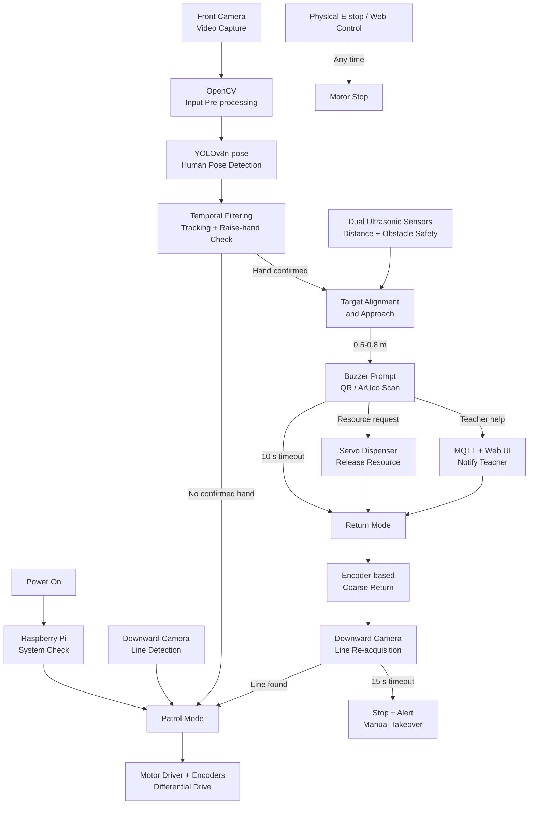

# TA-Bot: Advance Proposal

## 1. System Structure and Workflow



**Component roles**

- Raspberry Pi 5: main controller, AI inference, state machine, communication
- Front camera: hand-raise detection, target alignment, request-card scan
- Downward camera: line following, route recovery, optional junction detection
- Encoders: wheel-speed feedback, coarse return odometry
- Ultrasonic sensors: obstacle detection, final stopping distance
- Motors and driver: patrol, turning, approach, return
- Servos: resource-bin release
- Buzzer and RGB LED: interaction and fault prompts
- MQTT and Web UI: internal events, teacher notification, supervisory control

## 2. Deep Learning Model

**Purpose**

- Human detection
- 17-body-keypoint estimation
- Raised-hand recognition
- Student position estimation: left / center / right
- Rough distance hint: far / mid / near
- Target guidance during approach

**Model**

- Primary: `YOLOv8n-pose`
- Pre-trained on COCO human-pose data
- Raised-hand rule: wrist above nose or shoulder
- Deployment: Raspberry Pi 5, NCNN / ONNX INT8
- Backup: PC-based inference over local Wi-Fi

**Project data**

- No training from scratch
- Classroom validation data:
  - 3-5 m viewing distance
  - Different students, clothes, lighting, and seated poses
  - Single-person and multi-person scenes
  - Partial occlusion
  - Positive samples: raised hands
  - Negative samples: normal sitting, touching hair, stretching
- Minimum evaluation set: 50 raised-hand + 50 non-raised-hand cases
- Fine-tuning only if detection rate is below 80%
- Request cards: QR / ArUco; no deep-learning training

## 3. Input Pre-processing

**Required: Yes**

**Processing unit**

- Raspberry Pi vision process
- OpenCV + Ultralytics inference pipeline

**Steps**

- Continuous camera capture: 640 × 480
- Frame sampling: target 5 FPS inference
- Letterbox resize: 640 × 640
- Aspect-ratio preservation
- BGR → RGB conversion
- Pixel normalization: `[0, 255]` → `[0, 1]`
- Tensor conversion
- Optional low-light enhancement: CLAHE / exposure locking

**Request-card input**

- Center-region cropping
- Grayscale conversion
- Optional adaptive thresholding
- Optional perspective correction

**PC-inference backup**

- JPEG quality: 70
- MJPEG stream: 5-10 FPS
- Local Wi-Fi transmission
- Default mode: local frames; no image upload

## 4. Output Post-processing

**Required: Yes**

**Processing unit**

- Raspberry Pi vision post-processing module

**Steps**

- Person/keypoint confidence filtering
- Raised-hand rule evaluation
- Person association: bounding-box IoU / nearest center
- Temporal confirmation:
  - 5 FPS: at least 7 positives in 10 frames
  - 3 FPS: at least 4 positives in 6 frames
- Position stability: center deviation below 15% of frame width
- Direction output: left / center / right
- Rough distance classification: far / mid / near
- Multi-student priority: first confirmation, then confidence
- Event debounce: 3 s
- Target-loss handling: cancel after 3 s

**Final output**

```json
{
  "bearing": "left",
  "target_x": 0.31,
  "distance_hint": "mid",
  "confidence": 0.87,
  "track_id": 3
}
```

## 5. Product Form

**Type**

- Four-wheel differential-drive mobile robot
- Multi-level vehicle chassis

**Physical layout**

- Bottom: battery, motors, motor drivers
- Middle: Raspberry Pi, optional Arduino, power converters
- Top: two-bin resource dispenser
- Front: wide-angle camera, dual ultrasonic sensors
- Bottom/front-downward: line-following camera
- Exterior: RGB LED, buzzer, main switch, physical E-stop

**Camera placement**

- Near vehicle rotation centerline
- Reduced visual translation during in-place turns

## 6. Sensors and Components

| Category | Component | Function |
| --- | --- | --- |
| Main controller | Raspberry Pi 5 | AI, state machine, communication, Web UI |
| Vision | Front wide-angle camera | Hand detection, tracking, card scan |
| Vision | Downward camera | Line following, line recovery, junction IDs |
| Distance | 2 × HC-SR04 | Obstacle detection, stopping protection |
| Motion feedback | Motor encoders | Wheel speed, distance, coarse return |
| Actuation | 4 × geared DC motors | Vehicle movement |
| Motor control | 2 × TB6612FNG | Direction and PWM speed control |
| Dispensing | 2 × servos | Resource-bin gates |
| Feedback | Buzzer + RGB LED | Prompt, status, fault alert |
| Safety | Physical E-stop | Direct motor-power cutoff |
| Power | 3S battery + regulators | Separate Pi, motor, and servo supplies |
| Optional slave | Arduino / RP2040 | Motor PWM, encoder reading, timeout stop |

## 7. Physical Actions and Mechanisms

**Vehicle motions**

- Line-following patrol
- Forward motion and deceleration
- Differential steering
- In-place rotation
- Visual target alignment
- Low-speed student approach
- Obstacle stop
- Encoder-assisted return
- Visual line re-acquisition

**Service actions**

- Buzzer prompt: show request card / collect resource
- Servo gate opening
- Gravity-fed resource release
- Automatic gate closing
- RGB fault/status indication

**Mechanical design choice**

- Two-bin, servo-controlled gravity dispenser
- Faster integration than robotic arm / conveyor
- Lower positioning and jamming risk

## 8. Control Mode

**Primary mode: autonomous**

- Autonomous patrol
- Hand-raise detection
- Target approach
- Request-card recognition
- Resource dispensing / teacher notification
- Automatic return to patrol line

**Supervisory mode**

- Teacher Web UI: start / pause / emergency stop

**Fallback mode**

- Keyboard or Web teleoperation
- Manual recovery after failed approach / return

**Classification**

- Supervised autonomous mobile robot
- Autonomous operation + human override

## 9. Communication Architecture

| Link | Method | Data |
| --- | --- | --- |
| Cameras → Raspberry Pi | CSI / USB + V4L2 | Raw video frames |
| Vision module → State machine | MQTT over TCP | Hand, direction, card events |
| State machine → Motion module | MQTT over TCP | Drive, turn, stop, line-follow commands |
| Raspberry Pi → Arduino, optional | USB Serial / UART, 115200 bps | Wheel-speed targets, stop, heartbeat |
| Arduino → Raspberry Pi | USB Serial / UART | Encoder counts, wheel speed, status |
| Raspberry Pi / Arduino → Motor drivers | GPIO + PWM | Motor direction and speed |
| Ultrasonic sensors → Controller | GPIO Trigger / Echo | Distance measurements |
| Raspberry Pi → Servos / buzzer / LED | GPIO + PWM | Dispense and feedback commands |
| Teacher browser → Raspberry Pi | HTTP | Start, pause, emergency stop |
| Raspberry Pi → Teacher browser | SSE over HTTP | Robot status, help notification |
| Raspberry Pi → PC, backup | MJPEG / RTSP over Wi-Fi | Compressed video stream |
| PC → Raspberry Pi, backup | MQTT over TCP | Inference results |

**Fail-safe communication**

- Arduino heartbeat timeout: 300 ms → motor PWM = 0
- Vision timeout: 3 s → cancel approach
- Return-line timeout: 15 s → stop and request takeover
- Network failure: local safety stop remains active
